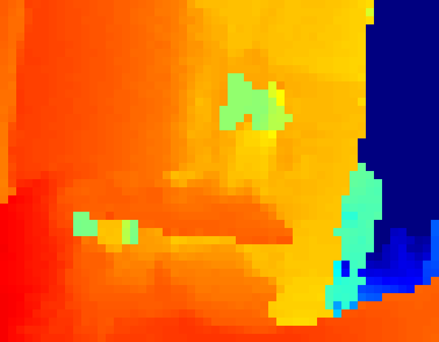

# VL53L9CX ToF LiDAR on Raspberry Pi (MIPI CSI-2)

Live **54 × 42-zone depth streaming at 100 fps** from an ST **VL53L9CX** multi-zone
Time-of-Flight LiDAR, over **MIPI CSI-2** into a Raspberry Pi 4, decoded and rendered
in real time with OpenCV.

<p align="center">
  
</p>

The VL53L9CX streams its result buffer over CSI-2 as RAW8. This project boots the
sensor over I²C, captures the raw stream with the Pi's Unicam receiver, un-packs the
ST result buffer, and colour-maps the depth array — all at the sensor's full 100 Hz.

---

## Features

- **Full-resolution 54 × 42 depth** (binning 2) at a true **100 fps**
- One-command bring-up + live viewer (`run_lidar.sh`) and a desktop launcher icon
- Correct decode of the ST result buffer (distance / amplitude / ambient / DSS layout)
- Live orientation control and per-frame stats overlay
- Selectable binning-4 (24 × 24) mode
- **GPU-shader particle viewer** (`run_lidar_gpu.sh`) — the whole simulation runs in
  GLSL on the Pi's V3D GPU; see [`docs/GPU_VIEWER_CONTROLS.md`](docs/GPU_VIEWER_CONTROLS.md)
- **LiDAR Web Studio** (`run_lidar_web.sh`) — a networked browser dashboard with a live
  WebGL 3D point cloud, gesture recognition, recording/replay, and PLY export; see
  [`docs/WEB_STUDIO.md`](docs/WEB_STUDIO.md)

---

## Hardware

| Part | Notes |
|------|-------|
| Raspberry Pi 4 (BCM2711) | Running Raspberry Pi OS (kernel 6.x, Unicam / `bcm2835-unicam`) |
| STEVAL-VL53L9 | ST evaluation board carrying the VL53L9CX module |
| FFC / flex cable | STEVAL flex → Pi CSI (camera) connector: 1 MIPI data lane + I²C |

### Wiring note — XSHUT

The VL53L9CX's **XSHUT** (enable) pin is **not** broken out to a controllable Pi GPIO
through the ribbon on this setup. On the STEVAL **J2 header** it's **pin 5** — tie it
to **pin 8 (3V3)** with a jumper so the sensor is enabled.

> Because XSHUT is hard-tied, there is no software hardware-reset. A fresh power-up
> (or briefly reseating the jumper) puts the sensor in `READY_TO_BOOT` for a clean
> firmware init. This is only needed once per power cycle — see
> [Implementation notes](#implementation-notes).

---

## Repository layout

```
.
├── app/
│   └── vl53l9_bringup.c      # I²C bring-up: init → profile → CSI config → start streaming
├── viewer/
│   └── visualize.py          # reads the RAW8 FIFO, decodes + colour-maps the depth array
├── driver/
│   ├── dummy_cam.c           # stub CSI-2 subdev so Unicam will bind and DMA the stream
│   ├── Makefile
│   └── vl53l9-mipi.dts       # device-tree overlay binding the dummy sensor to csi1
├── vendor/st-uld/            # ST VL53L9CX ULD driver (SLA0111) — see LICENSE.txt
├── scripts/
│   ├── hw_reset.py           # GPIO reset helper (see wiring note)
│   └── lidar.desktop         # desktop launcher entry
├── run_lidar.sh             # one-shot: build if needed, start stream + viewer
├── Makefile
└── docs/
```

---

## Build & install

### 1. Kernel module + device-tree overlay (one-time)

The Pi needs a subdevice bound to the CSI port so Unicam will enable its receiver and
DMA the sensor's stream (the VL53L9CX is controlled out-of-band over I²C, so a small
stub sensor driver stands in on the media graph).

```bash
# Build and load the stub CSI-2 sensor module
make module
sudo insmod driver/dummy_cam.ko

# Compile + install the device-tree overlay
dtc -@ -I dts -O dtb -o vl53l9-mipi.dtbo driver/vl53l9-mipi.dts
sudo cp vl53l9-mipi.dtbo /boot/firmware/overlays/
# then add to /boot/firmware/config.txt:
#   dtoverlay=vl53l9-mipi
sudo reboot
```

Confirm the CSI capture node and dummy subdev exist:

```bash
v4l2-ctl --list-devices        # expect: unicam (fe801000.csi) -> /dev/video0
ls /dev/v4l-subdev0            # the dummy-csi2 sensor
```

### 2. Bring-up app

```bash
make          # builds ./vl53l9_bringup from app/ + vendor/st-uld/
```

### 3. Desktop launcher (optional)

```bash
cp scripts/lidar.desktop ~/Desktop/
gio set ~/Desktop/lidar.desktop metadata::trusted true
```

---

## Run

```bash
./run_lidar.sh          # 54x42 @ 100 fps (default)
./run_lidar.sh 4        # 24x24 (binning 4)
./run_lidar.sh 2 8      # binning 2, 8 ms exposure
```

Or double-click the **ToF LiDAR** desktop icon.

**Viewer keys:** `r` cycles orientation (raw / flipV / flipH / rot180), `q` quits.
Stop everything with `sudo killall -9 python3 v4l2-ctl`.

---

## How it works

```
VL53L9CX ──MIPI CSI-2 (RAW8, 1 lane, 1 Gbps)──▶ Pi Unicam ──DMA──▶ /dev/video0
   ▲ I²C (0x29, /dev/i2c-10)                                           │
   │                                                    v4l2-ctl --stream-to
vl53l9_bringup                                                         ▼
   init → profile → CSI cfg → start                              /tmp/tof_pipe (FIFO)
                                                                       │
                                                        viewer/visualize.py (decode + render)
```

The sensor streams its **result buffer**, not an image. For binning 2 (54 × 42 = 2268
raw zones) each CSI frame is laid out as:

```
[ distance u16 × N | amplitude u16 × N | ambient u16 × N | DSS 4-bit/zone | status line ]
```

Unicam pads each 100-byte line to a 128-byte stride; the viewer de-strides, slices the
distance array, masks the 15-bit value (`mm = raw & 0x7FFF`), reshapes to 54 × 42 and
colour-maps by range. The trailing **status line** (frame counter, temperature, metadata)
is the extra CSI row and is dropped.

---

## Implementation notes

Things that were non-obvious and are baked into the code:

- **The result code from `vl53l9_init()` / `vl53l9_start()` is `-5` (TIMEOUT) even on
  success** — the ULD's command-ack poll is tuned for the STM32 reference and times out
  over Linux user-space I²C. Trust the **FSM register** (`0x008C`: 1 = `READY_TO_BOOT`,
  2 = `STANDBY`, 3 = `STREAMING`), not the return value.
- **Firmware-boot timeouts were widened** in the ULD (`_write_cmd`/`_wait_for_state`
  from 71 ms / 4 ms → 3000 ms) so the 32 KB patch load + boot handshake completes over
  I²C. A clean `vl53l9_init()` must run from `READY_TO_BOOT` (i.e. after a power-up).
- **100 fps requires DSS disabled.** With Dynamic SPAD Selection on, the extra
  acquisition pass caps the rate at exactly 50 fps; disabling it (per the datasheet's
  100 fps "Gaming" profile: precision context, regular power, 4 ms exposure) hits 100.
- **Unicam must be armed before the sensor's D-PHY (re)starts**, or no frames arrive.
  The dummy subdev pad format must match the capture height (148 for binning 2, 38 for
  binning 4).
- **Distances are raw radial, uncalibrated** 15-bit values. True perpendicular
  millimetres need ST's post-processing ISP (`transform` library) with a calibration
  buffer — not integrated here.

---

## Limitations / roadmap

- Raw radial depth only — no calibration / radial-to-perpendicular / TNR (ST ISP)
- Amplitude & ambient arrays are decoded off the wire but not yet displayed
- Sensor reset is a manual power-cycle (XSHUT is hard-tied on this board)

---

## License

- Original work in this repository (bring-up app, viewer, kernel module, overlay,
  scripts, docs) — **MIT**, see [`LICENSE`](LICENSE).
- `vendor/st-uld/` — © STMicroelectronics, **SLA0111**, see
  [`vendor/st-uld/LICENSE.txt`](vendor/st-uld/LICENSE.txt). SLA0111 permits source
  redistribution provided the ST copyright notices and license text are retained.

Not affiliated with or endorsed by STMicroelectronics. VL53L9CX and STEVAL are ST
trademarks.
